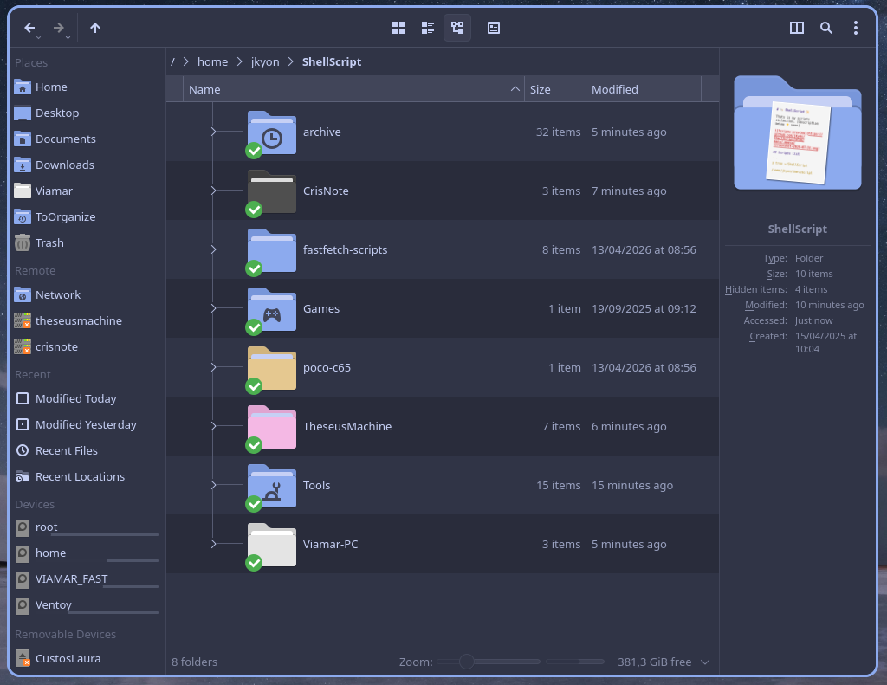

# 🐚 ShellScript 📜

Thats is my scripts collection. (Description below 👇 soon)



## Scripts List

```
❯ tree ~/ShellScript

~/ShellScript
├── 01-media
│   └── shellscript-overview.png
├── archive
│   ├── ananicy-exclude.sh
│   ├── awesome-notify-test.sh
│   ├── awesome-statusbar-crisnote
│   │   ├── StatusBar-Scripts
│   │   │   ├── battery-widget.sh
│   │   │   ├── CPU-freq-monitor.sh
│   │   │   ├── CPU-monitor.sh
│   │   │   ├── CPU-temp-monitor.sh
│   │   │   ├── CPU-usage-monitor.sh
│   │   │   ├── RAM-monitor.sh
│   │   │   └── RAM-usage-monitor.sh
│   │   └── StatusBar-Scripts.old
│   │       ├── crisNoteBatteryLevel
│   │       ├── crisNoteCpuTemp
│   │       ├── CrisNoteCPUtemp.sh
│   │       └── CrisNotoBatteryCapacity.sh
│   ├── awesome-StatusBar-Scripts-viamar-pc
│   │   ├── cpu_monitor.lua
│   │   ├── lib
│   │   │   ├── formatters.lua
│   │   │   └── monitor.lua
│   │   └── ram_monitor.lua
│   ├── awesome-WM-widgets
│   │   ├── DoNotDisturb_widget.lua
│   │   ├── internet_widget.lua
│   │   ├── paru_update_checker.lua
│   │   └── portage-update-checker
│   │       ├── portage-update-checker.lua
│   │       └── README.md
│   ├── backInTime-gpgKeys-backup.sh
│   ├── feh_custom
│   ├── gentoo-addUSEpackage.sh
│   ├── gentoo-sync.sh
│   ├── gentoo-unmaskPackage.sh
│   ├── gentoo-update.sh
│   ├── jkyon-scrub.sh
│   ├── kdeConnect-refresh.sh
│   ├── lockScreen.sh
│   ├── mycompsize.sh
│   ├── myfetch.sh
│   ├── notification-test.sh
│   ├── picom-memoryMonitor.sh
│   ├── picom-restartRoutine1.sh
│   ├── picom-restartRoutine.sh
│   ├── pipewire-restart.sh
│   ├── PortageRsyncDotfiles.sh
│   ├── rofi-recoll.sh
│   ├── screenshots-scripts
│   │   ├── flameshot-window
│   │   └── main-window-screenshot
│   ├── snapShotsPreview.sh
│   ├── startUpApps-CrisNote.sh
│   ├── startUpApps.sh
│   ├── startUpApps-Viamar-PC.sh
│   ├── StatusBar-Scripts.old
│   │   ├── awesomeWidget-CPU-freq-monitor.sh
│   │   ├── awesomeWidget-gpu0freq.sh
│   │   ├── awesomeWidget-gpu0temp.sh
│   │   ├── awesomeWidget-gpu0usage-fast.sh
│   │   ├── awesomeWidget-gpu0usage.sh
│   │   ├── awesomeWidget-gpu1freq.sh
│   │   ├── awesomeWidget-gpu1temp.sh
│   │   ├── awesomeWidget-PSU-monitor.sh
│   │   ├── awesomeWidget-PSU-temp-monitor.sh
│   │   ├── awesomeWidget-trackingAwesomeMemoryUse.sh
│   │   ├── dwmBlocksCpuTemp
│   │   ├── dwmBlocksCpuUsage
│   │   ├── dwmBlocksMemUsage
│   │   ├── dwmBlocksNice
│   │   ├── dwmBlocksUpdates
│   │   ├── dwmBlocksVolumeAudio
│   │   └── memoryUsage-widget.sh
│   ├── templates
│   │   └── shellScript-template.sh
│   ├── theseusmachine
│   │   ├── PortageSync.old
│   │   │   ├── PortageDailyAutomation.sh
│   │   │   ├── PortageSync.sh
│   │   │   └── PortageUpdateMirrors.sh
│   │   ├── startUpApps-TheseusMachine.sh
│   │   ├── startUpApps-TheseusMachine-with-nice.sh
│   │   ├── StatusBar-Scripts
│   │   │   ├── CPU-freq-monitor.sh
│   │   │   ├── CPU-monitor.sh
│   │   │   ├── CPU-temp-monitor.sh
│   │   │   ├── CPU-usage-monitor.sh
│   │   │   ├── GPU-freq-monitor.sh
│   │   │   ├── GPU-monitor.sh
│   │   │   ├── GPU-temp-monitor.sh
│   │   │   ├── GPU-usage-monitor.sh
│   │   │   ├── PSU-monitor.sh
│   │   │   ├── PSU-temp-monitor.sh
│   │   │   ├── PSU-usage-monitor.sh
│   │   │   ├── RAM-monitor.sh
│   │   │   └── RAM-usage-monitor.sh
│   │   └── tmux-quickstart.sh
│   └── theseusMachine-core-etc-sync.sh
├── CrisNote
│   ├── fastfetch
│   │   ├── ffetch-CrisNote.jsonc
│   │   └── ffetch-crisnote-ssh.jsonc
│   ├── scripts
│   │   └── upgrade-kernel-arch
│   │       └── upgrade-kernel-arch.sh
│   └── tools
│       └── wake-theseusmachine
│           └── wake-theseusmachine.sh
├── fastfetch-scripts
│   ├── fastfetch-awesome-version.sh
│   ├── fastfetch-btrfs+bees-version-pacman.sh
│   ├── fastfetch-btrfs+bees-version-portage.sh
│   ├── fastfetch-btrfs+bees-version.sh
│   ├── fastfetch-MoBo-info.sh
│   ├── fastfetch-packageManager-version.sh
│   ├── fastfetch-sudo+polkit-version.sh
│   └── fastfetch-zsh+tmux-version.sh
├── Games
│   └── satisfactory-server-update.sh
├── poco-c65
│   └── fastfetch
│       └── ffetch-poco-c65.jsonc
├── README.md
├── TheseusMachine
│   ├── etc-dotfiles.sh
│   ├── portage-tools
│   │   ├── gentoo-cleanup-guard
│   │   │   └── gentoo-cleanup-guard.sh
│   │   ├── portage-unused-ranker
│   │   │   ├── portage-unused-ranker.sh
│   │   │   └── README.md
│   │   ├── update-portage.sh
│   │   └── upgrade-portage.sh
│   ├── post-backup-snapshot.sh
│   ├── scripts
│   │   └── auto-idle-suspend
│   │       ├── auto-idle-suspend.sh
│   │       ├── auto-suspend.service
│   │       └── lock-screen.sh
│   ├── tools
│   │   ├── rambox-cleanup
│   │   │   └── rambox-cleanup.sh
│   │   ├── rambox-cleanup.sh
│   │   └── upgrade-kernel
│   │       ├── README.md
│   │       └── upgrade-kernel.sh
│   └── waybar
│       ├── scrips
│       │   ├── ephedrine.sh
│       │   ├── mako-dnd.sh
│       │   ├── mediaplayer.py
│       │   └── power_menu.xml
│       └── status-bar
│           ├── gpu-monitor.sh
│           ├── network-monitor.sh
│           └── psu-monitor.sh
├── Tools
│   ├── avisoNoTerminal.sh
│   ├── borg_backup-hourlyRoutine.sh
│   ├── bulk-ocr
│   │   ├── bulk-ocr.sh
│   │   └── README.md
│   ├── ephedrine
│   │   ├── ephedrine.lua
│   │   ├── ephedrine.sh
│   │   └── README.MD
│   ├── ffetch
│   │   └── ffetch.sh
│   ├── imake
│   │   ├── emake
│   │   │   └── emake.sh
│   │   ├── lib
│   │   │   └── detect-distro.sh
│   │   └── vmake
│   │       └── vmake.sh
│   ├── ls-font-char.sh
│   ├── OpenSeeFace.sh
│   ├── rambox-cleanup
│   │   └── rambox-cleanup.sh
│   ├── scan-to-ai
│   │   ├── README.md
│   │   └── scan-to-ai.sh
│   ├── ssh-test-connection
│   │   └── ssh-test-connection.sh
│   ├── update-distro
│   │   └── updateDistro.sh
│   ├── upgrade-distro
│   │   └── upgradeDistro.sh
│   ├── watch19.sh
│   └── xclip-output-to-clipboard
│       ├── README.md
│       ├── xclip-output-to-clipboard.sh
│       └── xclip-output-to-clipboard-v1.sh
└── Viamar-PC
    ├── Scripts
    │   ├── lock-screen
    │   │   ├── lock-screen.sh
    │   │   └── prelock-screenoff.sh
    │   ├── upgrade-kernel-arch
    │   │   └── upgrade-kernel-arch.sh
    │   ├── wake-builder
    │   │   └── wake-builder.sh
    │   └── wake-viamar
    │       └── wake-viamar.sh
    ├── updateParu.sh
    └── upgradeParu.sh

58 directories, 152 files
---
```